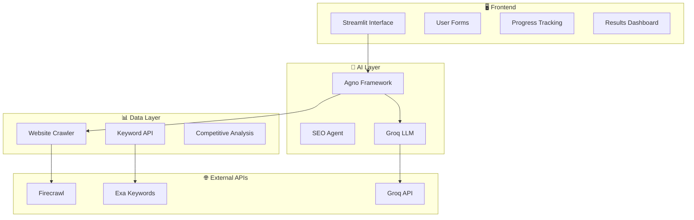

# 🔍 **SEO InsightHub - AI-Powered SEO Analysis Platform** 

[](https://python.org)
[](https://streamlit.io)
[](https://github.com/agno-framework)
[](LICENSE)

> 🎯 **Transform your SEO strategy with AI-powered insights!** Comprehensive SEO audits, competitive analysis, and actionable recommendations through an intuitive interface.

---

## ✨ Key Features

### 🧠 **AI-Powered Intelligence**
- **Agno Agent Framework** - Advanced AI analysis with specialized SEO agents
- **Groq LLM Integration** - Lightning-fast intelligent insights  
- **Smart Recommendations** - Context-aware, prioritized suggestions
- **Confidence Scoring** - AI confidence metrics for each recommendation

### 🔍 **Comprehensive SEO Audit**
- **Technical Analysis** - Page speed, mobile-friendliness, meta tags optimization
- **Content Assessment** - Word count, heading structure, readability scores
- **Performance Metrics** - Core Web Vitals, user experience indicators

### ⚔️ **Competitive Intelligence**
- **Multi-Competitor Analysis** - Compare against up to 5 competitors
- **Performance Benchmarking** - Speed, content depth, mobile optimization
- **Gap Analysis** - Identify opportunities and market positioning

### 🔑 **Advanced Keyword Research**
- **Search Volume Analysis** - Real-time keyword performance data
- **Trending Opportunities** - Emerging keyword identification
- **Long-tail Suggestions** - Medium-volume keyword opportunities

---

## 🏗️ **System Architecture**


## 🔄 Application Flow Diagram


---

## 📁 **Project Structure**

```
seo-insighthub/
├── 🔧 api/
│   ├── exa.py           # Keyword research
│   ├── firecrawl.py     # Web crawling
│   └── groq.py          # AI analysis
├── 🛠️ dosumentation/
│   └── SE0-InsightHub.docx
├── ├── images
│   └── logo.jpeg
├── ├── main.jpeg
├── 🚀 app.py            # Main application
├── 🧪 demo.py           # Testing scripts
└── 📖 README.md
```

---

## 🚀 **Quick Start Guide**

### 📋 **Prerequisites**
- Python 3.8+ 🐍
- Git 📦
- API Keys (Groq, Firecrawl, Exa) 🔑

### ⚡ **Installation**

```bash
# 1️⃣ Clone Repository
git clone https://github.com/SimranShaikh20/seo-insighthub.git
cd seo-insighthub

# 2️⃣ Setup Environment
python -m venv venv
source venv/bin/activate  # Windows: venv\Scripts\activate

# 3️⃣ Install Dependencies
pip install -r requirements.txt

# 4️⃣ Configure API Keys
echo "GROQ_API_KEY=your_key_here" > .env
echo "FIRECRAWL_API_KEY=your_key_here" >> .env
echo "EXA_API_KEY=your_key_here" >> .env

# 5️⃣ Launch Application
streamlit run app.py
```

🌐 **Access at:** `http://localhost:8501`

---

## 🛠️ **Configuration**

### 🔑 **API Keys Setup**

| Service | Purpose | Get Key |
|---------|---------|---------|
| 🤖 **Groq** | AI Analysis | [Console](https://console.groq.com) |
| 🕷️ **Firecrawl** | Web Crawling | [Dashboard](https://firecrawl.dev) |
| 🔍 **Exa** | Keyword Research | [API Portal](https://exa.ai) |

### ⚙️ **Agent Configuration**

```python
agent = Agent(
    name="SEO_Analyzer",
    role="Expert SEO analyst and strategist",
    llm=Groq(api_key=groq_api_key),
    tools=[DuckDuckGoTools()],
    storage=SqliteStorage(table_name="seo_analysis"),
    verbose=True
)
```

---

## 📊 **How to Use**

### 🎯 **Basic Analysis**

1. **🌐 Enter Website URL** - Input your primary site URL
2. **🥊 Add Competitors** - Up to 5 competitor URLs (optional)
3. **🔑 Target Keywords** - Comma-separated keyword list (optional)
4. **🚀 Run Analysis** - Click "Run Agno AI Analysis"

### 📈 **Understanding Results**

#### **SEO Score Scale**
- 🔴 **0-40**: Poor - Immediate attention required
- 🟡 **41-70**: Fair - Needs improvement  
- 🟢 **71-85**: Good - Minor optimizations
- ⭐ **86-100**: Excellent - Maintain performance

#### **Priority Levels**
- 🔴 **High**: Critical ranking issues
- 🟡 **Medium**: Important optimizations
- 🟢 **Low**: Nice-to-have improvements

---

## 📋 **Analysis Features**

### 🚨 **Immediate Actions**
- Critical issues requiring urgent attention
- Quick wins with high impact
- Timeline estimates and success metrics

### 📅 **Short-term Goals** 
- 1-3 month optimization objectives
- Monthly implementation breakdown
- Progress tracking and resource planning

### 🎯 **Long-term Strategy**
- 3-12 month SEO roadmap
- Quarterly milestones and ROI projections
- Authority building strategies

### 📊 **Detailed Insights**
- In-depth technical and content analysis
- Competitive gaps and keyword opportunities
- Visual performance indicators


---

## 🛡️ **Security & Privacy**

### 🔐 **Security Measures**
- Environment variable API key storage
- Input validation and sanitization
- Rate limiting implementation
- Comprehensive error handling

### 🔒 **Privacy Protection**
- No persistent website data storage
- Temporary session data only
- GDPR compliance considerations
- User data anonymization

---

## 🤝 **Contributing**

### 💻 **Development Process**
1. 🍴 Fork repository
2. 🌿 Create feature branch
3. 🧪 Add tests for new features
4. ✅ Run test suite
5. 📝 Update documentation
6. 🚀 Submit pull request

### 📏 **Code Standards**
- Follow PEP 8 guidelines
- Include comprehensive docstrings
- Add type hints where applicable
- Write meaningful test cases

---

## 🆘 **Troubleshooting**

### ⚠️ **Common Issues**

| Issue | Solution |
|-------|----------|
| 🔑 API Connection Error | Verify API keys in `.env` file |
| 🐌 Slow Performance | Reduce competitor count, enable caching |
| 💾 Memory Issues | Increase system memory, optimize data processing |
| 🌐 Website Access Error | Check URL format, firewall settings |

### 🐛 **Debug Mode**
```bash
export STREAMLIT_DEBUG=true
streamlit run app.py --logger.level debug
```

---

## 📝 **Version History**

### 🎉 **v2.0.0** (Current)
- ✨ Agno AI Framework integration
- 🚀 Advanced AI-powered analysis  
- 📊 Enhanced competitive intelligence
- 🎯 Improved keyword research capabilities

### 📈 **v1.5.0**
- 🤖 Groq LLM integration
- 📊 Real-time progress tracking
- 🎨 UI/UX improvements

---

## 📄 **License**

This project is licensed under the **MIT License** - see [LICENSE](LICENSE) for details.

---

## 🙏 **Acknowledgments**

- 🤖 **Agno Framework** - Powerful AI agent capabilities
- 🎨 **Streamlit** - Excellent web framework
- ⚡ **Groq** - High-performance LLM inference
- 🕷️ **Firecrawl** - Reliable web crawling
- 🏆 **SEO Community** - Insights and best practices


---

<div align="center">
  <strong>🚀 Built with ❤️ by the SEO InsightHub Team</strong><br>
  <em>⭐ Empowering websites with AI-driven SEO insights</em>
</div>