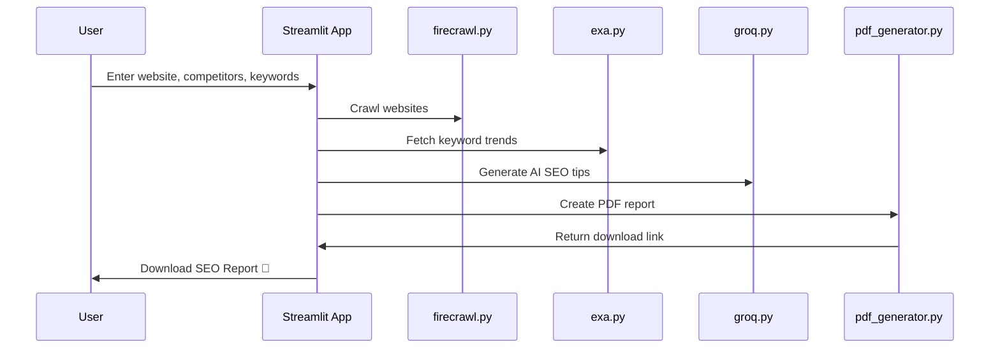

# 🔍 AI Powered SEO Analyzer Tool

AI Powered SEO Analyzer Tool is a smart SEO analysis platform that allows users to:

- Enter their website and competitors
- Analyze SEO data using crawling and keyword tools
- Get AI-powered SEO improvement suggestions
- Download a professional SEO report in PDF format

This project is perfect for digital marketers, SEO professionals, or business owners who want to stay ahead of the competition with data-backed insights.

---

## 🚀 What Does the Website Do?

1. ✅ Crawls your website and competitors' sites.
2. ✅ Collects keyword insights based on your business niche.
3. ✅ Compares SEO scores between you and competitors.
4. ✅ Generates AI-based tips to improve your site ranking.
5. ✅ Outputs a detailed SEO report you can download as a PDF.

---

## 🧠 System Architecture (Mermaid)

```mermaid
graph TD
  A[User Interface (Streamlit App)] --> B[firecrawl.py<br/>Scrape website & competitor data]
  A --> C[exa.py<br/>Fetch trending keywords]
  A --> D[groq.py<br/>Generate AI-based SEO tips]
  B --> E[pdf_generator.py<br/>Compile data into PDF]
  C --> E
  D --> E
  E --> F[User Downloads PDF Report]
```

---

## 🔁 Application Flow (Mermaid)



---

## 🛠️ Technologies Used

- **Python 3.x** – Programming language
- **Streamlit** – Web app framework for interactive UI
- **FPDF** – PDF generation library
- **Pandas** – Data manipulation and display
- **Custom APIs** – Crawling, keyword fetching, AI-generated SEO tips

---

## 💻 Getting Started

### ✅ Prerequisites

- Python 3.7 or higher
- pip (Python package installer)

### 📦 Installation

```bash
git clone https://github.com/SimranShaikh20/AI-Powered-SEO-Analyzer-Tool.git
cd seoinsighthub
python -m venv venv
# Windows
venv\Scripts\activate
# macOS/Linux
source venv/bin/activate
pip install -r requirements.txt
```

### 🚀 Running the Application

```bash
streamlit run app.py
```

Visit http://localhost:8501 to view the app.

---

## 📝 How to Use

- 🔗 Enter your **Website URL**
- 🆚 Enter **Competitor URLs**
- 🔑 Provide relevant **Keywords**
- 📊 Click **Run Analysis**
- 🤖 Review insights & tips
- 📄 Click **Download Report** to get the full SEO report as a PDF

---

## ⚙️ PDF Report Includes

- Website SEO overview
- Competitor comparison
- Keyword trends
- Actionable AI-generated SEO tips

---

## 🔧 Customization

- Modify `api/` modules to use your preferred data sources.
- Improve AI logic in `groq.py` to match your SEO style.
- Edit `utils/pdf_generator.py` to change PDF design.

---

## ❓ Troubleshooting

- ❌ Unicode error? Emojis and unsupported characters are filtered before PDF creation.
- ⛔ No PDF download? Ensure the analysis runs before clicking download.
- ❌ App not launching? Verify Python & Streamlit are installed properly.

---

## 📄 License

This project is licensed under the MIT License.

---

## 🙏 Acknowledgements

- [Streamlit](https://streamlit.io/)
- [FPDF Python](https://pyfpdf.github.io/)
- SEO & AI communities for inspiration

---

## 👤 Contact

**Your Name**  
🌐 GitHub: [SimranShaikh20](https://github.com/SimranShaikh20)
