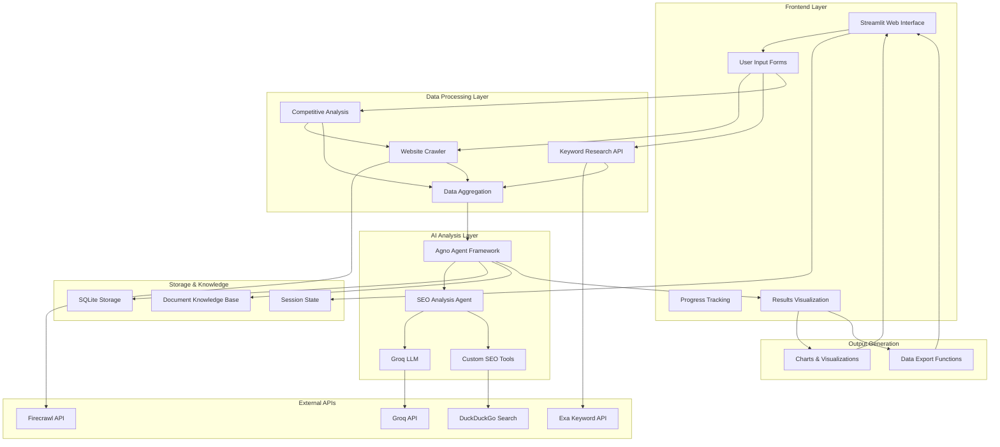
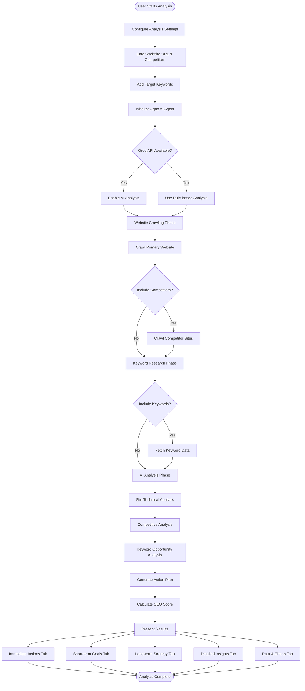

#  **SEO InsightHub - AI-Powered SEO Analysis Platform**

[](https://python.org)
[](https://streamlit.io)
[](https://github.com/agno-framework)
[](LICENSE)

SEO InsightHub is an advanced SEO analysis platform that combines traditional web crawling techniques with cutting-edge AI analysis powered by the Agno Agent Framework. It provides comprehensive SEO audits, competitive analysis, keyword research, and actionable recommendations through an intuitive Streamlit interface.

## 🌟 Key Features

### 🤖 AI-Powered Analysis
- **Agno Agent Framework Integration**: Advanced AI analysis using specialized SEO agents
- **Groq LLM Integration**: High-performance language model for intelligent insights
- **Smart Recommendations**: Context-aware, prioritized SEO recommendations
- **Confidence Scoring**: AI confidence metrics for each recommendation

### 📊 Comprehensive SEO Audit
- **Technical SEO Analysis**: Page speed, mobile-friendliness, meta tags
- **Content Quality Assessment**: Word count, heading structure, readability
- **On-Page Optimization**: Title tags, meta descriptions, keyword optimization
- **Performance Metrics**: Load times, user experience indicators

### 🥊 Competitive Intelligence
- **Multi-Competitor Analysis**: Compare against multiple competitors
- **Performance Benchmarking**: Speed, content depth, mobile optimization
- **Gap Analysis**: Identify opportunities and weaknesses
- **Market Positioning**: Understand your competitive landscape

### 🔑 Advanced Keyword Research
- **Search Volume Analysis**: Real-time keyword search volumes
- **Trending Keywords**: Identify emerging opportunities
- **Long-tail Opportunities**: Medium-volume keyword suggestions
- **Keyword Optimization**: Strategic keyword placement recommendations

### 📈 Professional Reporting
- **Comprehensive Analysis**: Detailed insights and recommendations
- **Executive Summaries**: High-level insights for stakeholders
- **Action Plans**: Prioritized, time-bound recommendations
- **ROI Projections**: Expected returns and timelines

## 🏗️ Architecture Overview



## 🔄 Application Flow Diagram



## 📁 Project Structure

```
seo-insighthub/
├── api/
│   ├── __pycache__/
│   ├── exa.py
│   ├── firecrawl.py
│   └── groq.py
├── utils/
│   ├── __pycache__/
│   └── data_processing.py
├── venv/
├── app.py
├── demo.py
└── README.md
```

### Directory Overview

- **`api/`** - External API integrations
  - `exa.py` - Exa keyword research API client
  - `firecrawl.py` - Firecrawl web crawling API client
  - `groq.py` - Groq LLM API integration
- **`utils/`** - Utility functions and helpers
  - `data_processing.py` - Data processing and analysis utilities
- **`app.py`** - Main Streamlit application
- **`demo.py`** - Demo and testing scripts
- **`venv/`** - Python virtual environment
- **`README.md`** - Project documentation

## 🚀 Quick Start

### Prerequisites
- Python 3.8 or higher
- pip package manager
- Git

### Installation

1. **Clone the Repository**
```bash
git clone https://github.com/SimranShaikh20/seo-insighthub.git
cd seo-insighthub
```

2. **Create Virtual Environment**
```bash
python -m venv venv
source venv/bin/activate  # On Windows: venv\Scripts\activate
```

3. **Install Dependencies**
```bash
pip install -r requirements.txt
```

4. **Set Up Environment Variables**
Create a `.env` file in the root directory:
```env
GROQ_API_KEY=your_groq_api_key_here
FIRECRAWL_API_KEY=your_firecrawl_api_key_here
EXA_API_KEY=your_exa_api_key_here
```

5. **Run the Application**
```bash
streamlit run app.py
```

The application will be available at `http://localhost:8501`

## 📋 Requirements

### Core Dependencies
```txt
streamlit>=1.28.0
pandas>=1.5.0
agno>=0.1.0
groq>=0.4.0
requests>=2.28.0
beautifulsoup4>=4.11.0
python-dotenv>=0.19.0
matplotlib>=3.6.0
plotly>=5.11.0
sqlite3
```

### Optional Dependencies (for enhanced features)
```txt
selenium>=4.0.0  # For JavaScript-heavy sites
pillow>=9.0.0   # For image processing
numpy>=1.21.0   # For numerical computations
scipy>=1.9.0    # For statistical analysis
```

## 🔧 Configuration Guide

### 1. API Keys Setup

#### Groq API Key
1. Visit [Groq Console](https://console.groq.com)
2. Sign up/Login to your account
3. Navigate to API Keys section
4. Generate a new API key
5. Add to your `.env` file

#### Firecrawl API Key
1. Go to [Firecrawl Dashboard](https://firecrawl.dev)
2. Create an account
3. Get your API key from the dashboard
4. Add to your `.env` file

#### Exa API Key
1. Visit [Exa API](https://exa.ai)
2. Sign up for an account
3. Generate API key
4. Add to your `.env` file

### 2. Agno Framework Configuration

The application uses Agno's agent framework with the following configuration:

```python
agent = Agent(
    name="SEO_Analyzer",
    role="Expert SEO analyst and strategist",
    goal="Provide comprehensive SEO analysis and actionable recommendations",
    llm=Groq(api_key=groq_api_key),
    tools=[DuckDuckGoTools()],
    storage=SqliteStorage(table_name="seo_analysis"),
    knowledge_base=DocumentKnowledgeBase(documents=[]),
    verbose=True,
    show_tool_calls=True
)
```

## 🎯 Usage Guide

### Basic Analysis

1. **Enter Website URL**
   - Input your primary website URL
   - Ensure URL includes protocol (https://)

2. **Configure Competitors** (Optional)
   - Add competitor URLs separated by commas
   - Up to 5 competitors recommended for optimal performance

3. **Add Target Keywords** (Optional)
   - Enter keywords separated by commas
   - Include both primary and long-tail keywords

4. **Run Analysis**
   - Click "🚀 Run Agno AI Analysis"
   - Monitor progress through the status indicators

### Advanced Configuration

#### AI Settings
- **Groq API Key**: Enable advanced AI analysis
- **Deep Analysis**: More detailed but slower analysis
- **Confidence Threshold**: Minimum confidence for recommendations

#### Analysis Options
- **Competitive Analysis**: Compare against competitors
- **Keyword Research**: Include keyword opportunities
- **Technical SEO Focus**: Emphasize technical aspects
- **Content Analysis**: Focus on content quality

### Understanding Results

#### SEO Score
- **0-40**: Poor - Requires immediate attention
- **41-70**: Fair - Needs improvement
- **71-85**: Good - Minor optimizations needed  
- **86-100**: Excellent - Maintain current performance

#### Priority Levels
- **🔴 High**: Critical issues affecting rankings
- **🟡 Medium**: Important optimizations
- **🟢 Low**: Nice-to-have improvements

#### Impact Scores
- **1-3**: Low impact on SEO performance
- **4-6**: Moderate impact on rankings
- **7-8**: High impact on visibility
- **9-10**: Critical for SEO success

## 📊 Features Deep Dive

### 1. Immediate Actions Tab
- **Critical Issues**: High-priority problems requiring immediate attention
- **Quick Wins**: Low-effort, high-impact optimizations
- **Timeline Estimates**: Expected implementation time
- **Success Metrics**: How to measure improvement

### 2. Short-term Goals Tab
- **1-3 Month Objectives**: Medium-term optimization goals
- **Monthly Breakdown**: Organized by implementation timeline
- **Progress Tracking**: Monitor completion status
- **Resource Requirements**: Effort and skill levels needed

### 3. Long-term Strategy Tab
- **Strategic Roadmap**: 3-12 month SEO strategy
- **Quarterly Milestones**: Major objectives by quarter
- **ROI Projections**: Expected returns and timelines
- **Authority Building**: Long-term ranking strategies

### 4. Detailed Insights Tab
- **Technical Analysis**: In-depth technical SEO review
- **Content Assessment**: Comprehensive content evaluation
- **Competitive Gaps**: Areas where competitors excel
- **Keyword Opportunities**: Untapped keyword potential

### 5. Data & Charts Tab
- **Performance Metrics**: Visual performance indicators
- **Competitive Comparison**: Side-by-side competitor analysis
- **Keyword Visualization**: Search volume and opportunity charts
- **Impact vs Effort Matrix**: Prioritization visualization

## 🔍 AI Analysis Capabilities

### Agno Agent Framework Features

#### 1. Intelligent Analysis
- **Context-Aware Recommendations**: AI considers industry and site type
- **Pattern Recognition**: Identifies complex SEO patterns
- **Trend Analysis**: Spots emerging SEO opportunities
- **Risk Assessment**: Evaluates potential SEO risks

#### 2. Dynamic Learning
- **Knowledge Base**: Continuously updated SEO knowledge
- **Experience Memory**: Learns from previous analyses
- **Best Practices**: Incorporates latest SEO guidelines
- **Algorithm Updates**: Adapts to search engine changes

#### 3. Custom Tools Integration
- **Technical SEO Tools**: Specialized analysis functions
- **Performance Analyzers**: Speed and UX evaluation tools
- **Content Quality Metrics**: Readability and relevance scoring
- **Competitive Intelligence**: Market analysis capabilities

### AI-Powered Insights

#### Technical SEO
```python
# Example AI analysis for page speed
if load_time > 3:
    ai_recommendation = agent.analyze_performance({
        "load_time": load_time,
        "page_size": page_size,
        "requests": request_count,
        "industry": site_category
    })
```

#### Content Optimization
```python
# AI content analysis
content_score = agent.evaluate_content({
    "word_count": word_count,
    "readability": readability_score,
    "keyword_density": keyword_metrics,
    "semantic_relevance": topic_analysis
})
```

## 📈 Analysis Reporting System

### Report Sections

#### 1. Executive Summary
- Overall SEO score and grade
- Key performance indicators
- Priority recommendation summary
- Expected ROI timeline

#### 2. Technical Analysis
- Page speed performance
- Mobile-friendliness assessment
- Core Web Vitals analysis
- Technical SEO checklist

#### 3. Content Evaluation
- Content quality metrics
- Keyword optimization status
- Heading structure analysis
- Meta tag optimization

#### 4. Competitive Analysis
- Market position assessment
- Competitor performance comparison
- Opportunity gap analysis
- Competitive advantage areas

#### 5. Action Plan
- Immediate actions (1-2 weeks)
- Short-term goals (1-3 months)
- Long-term strategy (3-12 months)
- Resource allocation recommendations

### Customization Options
- **Analysis Depth**: Adjust level of detail
- **Section Selection**: Choose relevant analysis areas
- **Priority Filtering**: Focus on specific priority levels
- **Custom Notes**: Add specific observations

## 🛠️ API Integration

### Firecrawl API
```python
def crawl_website(url):
    """Crawl website using Firecrawl API"""
    response = requests.post(
        "https://api.firecrawl.dev/v0/crawl",
        headers={"Authorization": f"Bearer {FIRECRAWL_API_KEY}"},
        json={"url": url, "options": {"onlyMainContent": True}}
    )
    return response.json()
```

### Exa Keyword API
```python
def fetch_keywords(keyword_list):
    """Research keywords using Exa API"""
    response = requests.post(
        "https://api.exa.ai/search",
        headers={"Authorization": f"Bearer {EXA_API_KEY}"},
        json={"query": " ".join(keyword_list), "num_results": 10}
    )
    return response.json()
```

### Groq LLM Integration
```python
def generate_seo_tips(site_data):
    """Generate AI-powered SEO recommendations"""
    client = Groq(api_key=GROQ_API_KEY)
    response = client.chat.completions.create(
        model="mixtral-8x7b-32768",
        messages=[{
            "role": "system",
            "content": "You are an expert SEO analyst..."
        }]
    )
    return response.choices[0].message.content
```

## 🧪 Testing

### Unit Tests
```bash
# Run unit tests
python -m pytest tests/unit/

# Run with coverage
python -m pytest tests/unit/ --cov=src/
```

### Integration Tests
```bash
# Test API integrations
python -m pytest tests/integration/

# Test end-to-end workflows
python -m pytest tests/e2e/
```

### Manual Testing Checklist
- [ ] Website crawling functionality
- [ ] AI analysis generation
- [ ] Competitive comparison
- [ ] Keyword research integration
- [ ] Data visualization
- [ ] Error handling scenarios

## 🚀 Deployment

### Local Development
```bash
streamlit run app.py --server.port 8501
```

### Production Deployment

#### Docker Deployment
```dockerfile
FROM python:3.9-slim

WORKDIR /app
COPY requirements.txt .
RUN pip install -r requirements.txt

COPY . .
EXPOSE 8501

CMD ["streamlit", "run", "app.py", "--server.address", "0.0.0.0"]
```

#### Streamlit Cloud
1. Push code to GitHub repository
2. Connect to Streamlit Cloud
3. Add environment variables
4. Deploy application

#### Heroku Deployment
```bash
# Create Procfile
echo "web: streamlit run app.py --server.port $PORT --server.enableCORS false --server.enableXsrfProtection false" > Procfile

# Deploy to Heroku
heroku create your-app-name
git push heroku main
```

## 🔒 Security Considerations

### API Key Management
- Store API keys in environment variables
- Use `.env` files for local development
- Implement key rotation policies
- Monitor API usage and quotas

### Data Privacy
- No persistent storage of analyzed websites
- Temporary session data only
- GDPR compliance considerations
- User data anonymization

### Input Validation
- URL format validation
- Input sanitization
- Rate limiting implementation
- Error handling and logging

## 🤝 Contributing

### Development Setup
1. Fork the repository
2. Create feature branch (`git checkout -b feature/amazing-feature`)
3. Install development dependencies (`pip install -r requirements-dev.txt`)
4. Make changes and add tests
5. Run test suite (`pytest`)
6. Commit changes (`git commit -m 'Add amazing feature'`)
7. Push to branch (`git push origin feature/amazing-feature`)
8. Open Pull Request

### Code Standards
- Follow PEP 8 style guidelines
- Add docstrings to all functions
- Include type hints where applicable
- Write comprehensive tests
- Update documentation

### Issue Reporting
- Use GitHub issues for bug reports
- Include reproduction steps
- Provide system information
- Add relevant logs and screenshots

## 📚 Documentation

### API Documentation
- Detailed function documentation
- Parameter descriptions
- Return value specifications
- Usage examples

### User Guides
- Step-by-step tutorials
- Best practices guide
- Troubleshooting section
- FAQ document

### Developer Documentation
- Architecture overview
- Code organization
- Extension guidelines
- API integration examples

## 🐛 Troubleshooting

### Common Issues

#### API Connection Errors
```python
# Check API key configuration
if not GROQ_API_KEY:
    st.error("Groq API key not configured")
    
# Verify API endpoint accessibility
try:
    response = requests.get("https://api.groq.com/health")
except requests.ConnectionError:
    st.error("Cannot connect to Groq API")
```

#### Memory Issues
- Increase system memory allocation
- Optimize data processing pipelines
- Implement data chunking for large sites
- Clear session state periodically

#### Performance Optimization
- Enable caching for repeated requests
- Implement async processing where possible
- Optimize database queries
- Use connection pooling

### Debug Mode
```bash
# Enable debug logging
export STREAMLIT_DEBUG=true
streamlit run app.py --logger.level debug
```

## 📝 Changelog

### Version 2.0.0 (Current)
- ✨ Agno AI Agent Framework integration
- 🚀 Advanced AI-powered analysis
- 📊 Enhanced competitive analysis
- 🎯 Improved keyword research
- 📈 Professional web-based reporting
- 🔧 Better error handling

### Version 1.5.0
- 🤖 Groq LLM integration
- 📈 Real-time analysis progress
- 🎨 UI/UX improvements
- 🔍 Enhanced crawling capabilities

### Version 1.0.0
- 🌟 Initial release
- 🕷️ Basic website crawling
- 📊 Simple SEO metrics
- 📋 Basic reporting

## 📄 License

This project is licensed under the MIT License - see the [LICENSE](LICENSE) file for details.

## 🙏 Acknowledgments

- **Agno Framework**: For the powerful AI agent capabilities
- **Streamlit Team**: For the excellent web app framework
- **Groq**: For high-performance LLM inference
- **Firecrawl**: For reliable web crawling services
- **SEO Community**: For insights and best practices

## 📞 Support

### Getting Help
- 📖 Check the documentation first
- 🐛 Search existing GitHub issues
- 💬 Join our Discord community
- 📧 Email support: support@seoinsighthub.com

### Professional Support
- 🏢 Enterprise consultations available
- 🎓 Training workshops
- 🔧 Custom integrations
- 📊 Advanced analytics setup

---

<div align="center">
  <strong>Built with ❤️ by the SEO InsightHub Team</strong><br>
  <em>Empowering websites with AI-driven SEO insights</em>
</div>